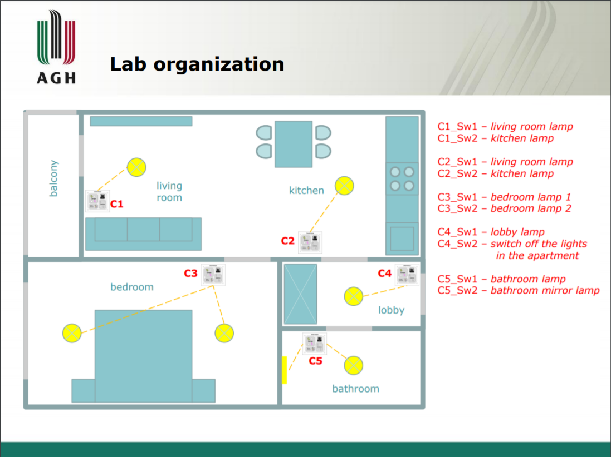
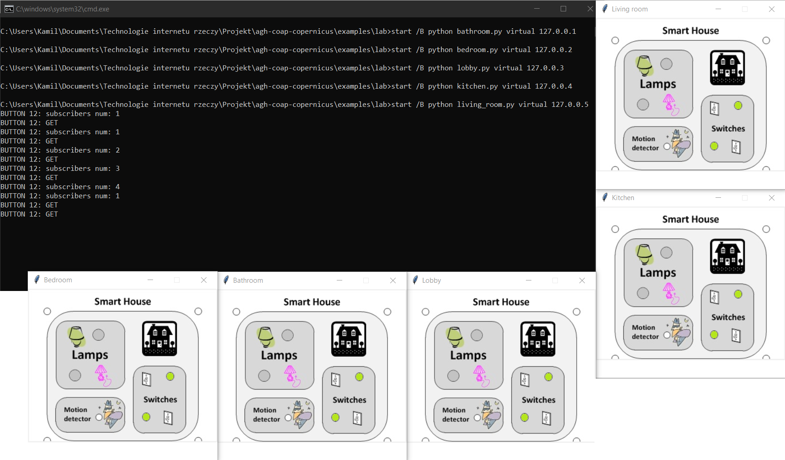
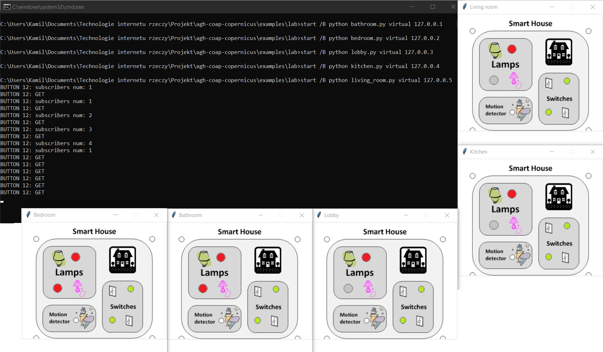

# Lab - Sterownik świateł wykorzystujący protokół CoAP

## Cel

Celem laboratorium jest zbudowanie sterownika świateł wykorzystującego protokół CoAP. Sterownik składa się z urządzeń pełniących funkcję zarówno serwera jak i klienta. Każdy z nich posiada adres IP (zakładamy, że wszystkie są w tej samej sieci). Za pomocą włącznika na jednym urządzeniu jesteśmy w stanie kontrlować diodę LED znajdującą się na innym urządzeniu.

Projekt jest zrealizowany za pomocą serwera zasobów CoAP stworzonego w ramach projektu.

Urządzenia zawierają zasob CoAP'a w postaci diod LED oraz przycisków, które można obserwować. Każde urządzenie w celu zmiany stanu swoich diod obserwuje i nasłuchuje na zmiany zasobów typu przycisk na innych urządzeniach.

## Organizacja pomieszczeń

Jest analogiczna do tej prezentowanej na zajęciach laboratoryjnych:



## Realizacja w kodzie

W każdym z urządzeń znajduje się następująca funkcja, wysyłająca request do serwera o adresie przekazanym w argumencie `ip`:

```python
async def observe_button(ip, name, callback):
    context = await Context.create_client_context()
    await asyncio.sleep(2)

    request = Message(
        code=Code.GET,
        uri=f'coap://{ip}/{name}',
        observe=0
    )

    requester = context.request(request)

    async for message in requester.observation:
        if message.payload == b'1':  # button pressed
            callback()
```

Po wywołaniu powyższej funkcji klient przechodzi w stan nasłuchiwania (`async for`).

Reakcję na odpowiednie zdarzenie możemy przypisać następujący sposób (na przykładzie `kitchen.py`):

```python
root.add_resource(['button1'], ButtonResource(11, lambda: led1.resource.toggle(), loop=event_loop))
root.add_resource(['button2'], ButtonResource(12, loop=event_loop))

tasks = []

asyncio.set_event_loop(event_loop)
asyncio.Task(Context.create_server_context(root, bind=(SERVER_IP, 5683)))
tasks.append(asyncio.ensure_future(observe_button('127.0.0.3', 'shutter', lambda: led1.resource.off())))
tasks.append(asyncio.ensure_future(observe_button('127.0.0.5', 'button2', lambda: led1.resource.toggle())))
event_loop.run_forever()
```

Dzięki powyższemu zapisowi sprawimy, że po wciśnięciu przycisku 'shutter', znajdującemu się na adresie 127.0.0.3 (reprezentującego lobby) zgasimy światło znajdujące się na obecnym urządzeniu (reprezentującym kuchnię), a po wciśnięciu przycisku 'button2' znajdującego się na obecnym urządzeniu, na adres 127.0.0.5 (reprezentujący salon) zostanie wysłany request o zmianę stanu światła. Cały kod wraz z gotowymi skryptami uruchamiającymi (zarówno na systemach z rodziny Windows jak i Linux) znajdują się w katalogu examples/lab.


## Przykład uruchomienia

Po uruchomieniu skryptu ukaże nam się pięć okienek reprezentujących pięć urządzeń oraz konsola:



Jak widać na powyższym zrzucie, w konsoli dostajemy informacje o ilości subskrybentów.
Odpowiednimi przyciskami możemy odpowiednio zapalać i gasić światła w pomieszczeniach zgodnie z zaprezentowanym wcześniej schematem (np. jeden z przycisków w kuchni steruje światłem w kuchni, a drugi w salonie. Jednym z przycisków znajdujących się w salonie jesteśmy w stanie zgasić światła w całym domu).


